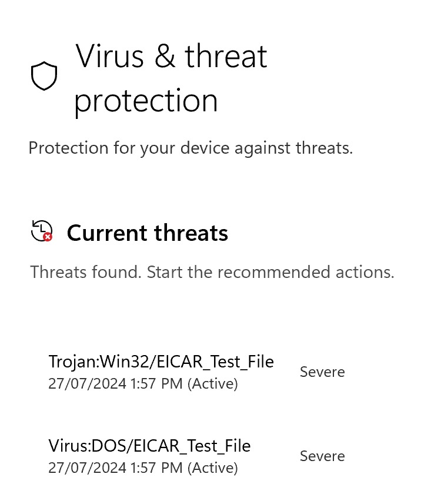

<h1 align="center">
  
  &nbsp;&nbsp;CyberScore
</h1>

Welcome to CyberScore, a comprehensive security tool available for both Windows and Mac. CyberScore is designed to evaluate the effectiveness of several key security measures on your computer, giving you insights and tools to enhance your system's security posture.  

## How to use it

  **WINDOWS** 
1. **Download CyberScore**: Download the Windows CyberScore.exe from Github - [Windows Download](https://github.com/CyberAutomationRobot/CyberScore/raw/main/CyberScore.exe)
2. **Run CyberScore**: Open CyberScore and start the security assessment by clicking on the "Score" button.

  **Mac** 
1. **Download CyberScore**: Download the Mac CyberScoreMacOS.zip from Github - [MacOS Download](https://github.com/CyberAutomationRobot/CyberScore/raw/main/CyberScoreMacOS.zip)
2. **Unzip CyberScore**: Double click on the CyberScoreMacOS.zip to unzip it
3. **Run CyberScore**: Open CyberScore App and start the security assessment by clicking on the "Score" button.

## Features

CyberScore evaluates the following areas of your system:

- **Application Whitelist Effectiveness**: Checks if unauthorized applications are blocked from running.
- **Office Macro Protection**: Tests protections against potentially malicious macros.
- **Anti-virus Efficiency**: Utilizes the eicar test virus to determine if your anti-virus software is effectively detecting and blocking threats.
- **Script Execution Safeguards**: Assesses the restrictions placed on script execution to prevent unauthorized scripts from running.
- **Open File Shares**: Identifies open file shares that might be at risk, especially if they contain sensitive information.
- **Default Credentials on Routers**: Scans for common default usernames and passwords that are often exploited.
- **Web Access Control Settings**: Reviews the settings that control web access to ensure they are secure.

After running these tests, CyberScore provides you with a score reflecting the current security status of your system along with detailed recommendations on how to improve your defenses.

## Important Notes

- **CyberScore does NOT contain viruses**: The screenshot below from VirusTotal shows that all commercial anti-virus products deem CyberScore to be safe.
  
- **Eicar Test Virus**: CyberScore uses the eicar test virus to test the response of your anti-virus software. This file is not a real virus but a test file used universally to test anti-virus protection. If your system reacts to this file, it is a good indication that your anti-virus is active and effective. If you see an alert or the file executes, simply close it; it is harmless.
- **False Positives**: Due to the nature of the eicar test virus, some anti-virus programs may detect CyberScore as malware. This detection is a false positive that can be safely ignored.
  
- **Eicar Files Opened**: Your anti-virus can make mistakes and sometimes the Eicar test signature files will open. Don't worry if this happens, just close those files and wait for the report to finish in your Web Browser.
- **CyberScore is quarantined or Blocked**: If CyberScore is blocked because your anti-virus detected the Eicar test signatures, just un-quarantine the CyberScore application and execute it. **Do not disable your anti-virus**.  
  
  
  

## Verified and Safe to Use

  **WINDOWS** 
1. **Enhanced Verification Signed Certificate**: The Windows CyberScore.exe has been signed and is safe for use.
2. **Signed Certificate Details**:  
   
   
   

  **Mac** 
1. **Apple Signed Certificate**: The Mac CyberScoreMacOS.zip has been signed by Apple and is safe for use.
2. **Signed Certificate Details**:  
   

### Secure and Undo Features (Paid Subscription)

- **Secure Button**: With a single click, you can harden your computer's security settings to enhance your Cyber Score. This feature adjusts settings based on the [ACSC's Essential 8](https://www.cyber.gov.au/resources-business-and-government/essential-cyber-security/essential-eight/essential-eight-explained). Available for Windows Only at this stage.  

- **Undo Button**: If the changes lead to operational issues, you can revert to the original settings with the single click Undo feature.

## Support

For support or more information, please visit our [Support Page](#) or contact our customer service team.

Thank you for choosing [Cyber Automation](https://www.cyberautomation.com.au) CyberScore to help secure your digital environment!

